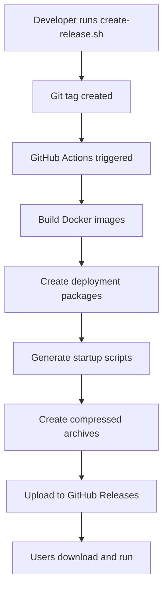

# Release Management Guide

## 🚀 Creating a New Release

### For Developers

1. **Create a new release:**
   ```bash
   ./scripts/create-release.sh 1.42.0
   ```

2. **What happens automatically:**
   - VERSION file is updated
   - Git tag is created
   - GitHub Actions builds deployment packages
   - Docker images are published
   - GitHub release is created with download links

### For End Users

1. **Download the release** from GitHub Releases
2. **Extract the package** to any directory
3. **Run the startup script**
4. **Access the application** at http://localhost

## 📦 Release Artifacts

Each release includes:

- **Windows Package**: `profitpath-v1.42.0-windows.zip`
- **Linux/Mac Package**: `profitpath-v1.42.0-linux-mac.tar.gz`
- **Universal Package**: `profitpath-v1.42.0-universal.tar.gz`

## 🔧 Manual Release Creation

If you need to create a release manually:

1. Go to GitHub Actions
2. Select "Create User-Friendly Deployment Artifacts"
3. Click "Run workflow"
4. Enter the version number
5. Click "Run workflow"

## 📋 Release Checklist

- [ ] Update VERSION file
- [ ] Create git tag
- [ ] Push to GitHub
- [ ] Verify GitHub Actions build
- [ ] Test deployment package
- [ ] Update release notes
- [ ] Notify users

## 🎯 User Experience

The deployment packages provide:

- **Zero technical knowledge required**
- **One-click startup**
- **Cross-platform support**
- **Self-contained packages**
- **Clear instructions**
- **Easy troubleshooting**

## 🔄 Release Process Flow



## 📊 Package Contents

Each deployment package contains:

```
profitpath-deployment/
├── docker-compose.yml    # Application configuration
├── start.sh             # Linux/Mac startup script
├── start.bat            # Windows startup script
├── stop.sh              # Linux/Mac stop script
├── stop.bat             # Windows stop script
├── README.md            # User instructions
└── VERSION              # Version information
```

## 🎉 Success Metrics

- **User Experience**: Can non-technical users deploy successfully?
- **Cross-Platform**: Works on Windows, Mac, and Linux
- **Self-Contained**: No additional dependencies required
- **Error Handling**: Clear error messages and troubleshooting
- **Documentation**: Comprehensive user guides

## 🆘 Troubleshooting Releases

### Common Issues

1. **Docker images not building**
   - Check Dockerfile syntax
   - Verify dependencies are available
   - Review build logs

2. **Packages not creating**
   - Check file permissions
   - Verify compression tools available
   - Review artifact upload logs

3. **Release not publishing**
   - Check GitHub token permissions
   - Verify release creation step
   - Review release notes format

### Support

For issues with the release process:
- Check GitHub Actions logs
- Review the workflow configuration
- Test locally before releasing
